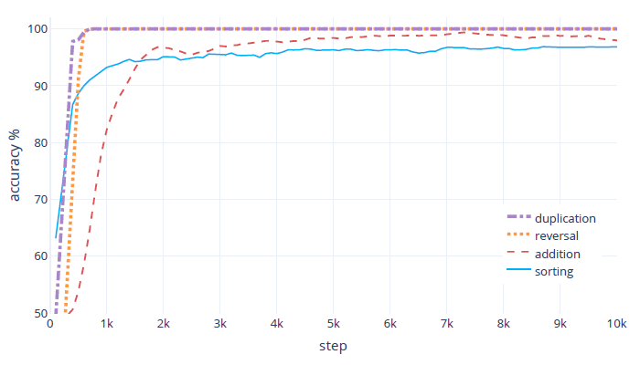

# Neural Shuffle-Exchange Networks: Official _TensorFlow_ Implementation

This repository contains the official _TensorFlow_ implementation of the following paper:

>**Neural Shuffle-Exchange Networks − Sequence Processing in O(*n* log *n*) Time**
>
> by Kārlis Freivalds, Emīls Ozoliņš, Agris Šostaks
>
> [[arXiv](https://arxiv.org/abs/1907.07897)] [[BibTeX](#citing-shuffle-exchange-neural-networks)]
>
>Abstract: _A key requirement in sequence to sequence processing is the modeling of long range dependencies. To this end, a vast majority of the state-of-the-art models use attention mechanism which is of O(n²) complexity that leads to slow execution for long sequences._
>
>_We introduce a new Shuffle-Exchange neural network model for sequence to sequence tasks which have O(log n) depth and O(n log n) total complexity. We show that this model is powerful enough to infer efficient algorithms for common algorithmic benchmarks including sorting, addition and multiplication. We evaluate our architecture on the challenging LAMBADA question answering dataset and compare it with the state-of-the-art models which use attention. Our model achieves competitive accuracy and scales to sequences with more than a hundred thousand of elements._
>
>_We are confident that the proposed model has the potential for building more efficient architectures for processing large interrelated data in language modeling, music generation and other application domains._

# Introduction

_Shuffle-Exchange neural network_ is a new differentiable architecture for sequence processing tasks that has O(log*n*) depth and O(*n* log *n*) total complexity and allows modeling any dependencies in the sequence. It can successfully learn nontrivial O(*n* log *n*) time algorithms with good generalization. The _Shuffle-Exchange_ model can serve as an alternative to the attention mechanism with better scaling to long sequences.

# Preview of results

Our paper describes _Shuffle-Exchange neural networks_ in detail and provides full results on sequence duplication, reversal, long binary addition, long binary multiplication, sorting tasks and the _LAMBADA_ question answering task.

Here are the accuracy results on the _[LAMBADA](https://www.aclweb.org/anthology/P16-1144)_ question answering task of predicting a target word in its broader context (on average 4.6 sentences picked from novels):

| **Model** | **Test accuracy (%)** |
| ------ | ------ |
| Random word from passage | 1.6 |
| _Gated-Attention Reader_ | 49.0 |
| ***Shuffle-Exchange neural network*** | **52.28** |
| _Universal Transformer_ | 56.0 |
| Human performance | 86.0 |

Note: Our used model is 7 times smaller and can process 32 times longer sequences using the same amount of GPU memory compared to the _Universal Transformer_ model.

- Our model with depth of 2 log *n* can learn sorting and long binary addition algorithms that generalize to longer inputs. Here are the accuracy results on the chosen sequential algorithmic tasks – generalization to sequences of length 512 where the model is trained on length 64:
****
- The algorithms that are learned by our model can process 128 times longer sequences and faster than the _[DNGPU model](https://arxiv.org/pdf/1702.08727)_ (optimized Neural GPU with diagonal gates).
- On long binary multiplication task, our model achieves 98% test accuracy on sequences of length 128. Training multiplication on longer sequences is possible but requires increasing the width or depth of the model.
  - Note: The fastest practical FFT-based algorithms are O(*n* log *n* loglog *n*) therefore it is expected that the solution does not generalize to inputs longer than the model is trained on.

# What are _Shuffle-Exchange neural networks_?

_Shuffle-Exchange neural networks_ are continuous, differentiable neural networks with a regular-layered structure consisting of alternating _Switch_ and _Shuffle_ layers.

The _Switch Layer_ divides the input into adjacent pairs of values and applies the _Switch Unit_, a learnable 2-to-2 function, to each pair of inputs producing two outputs.

Here is an illustration of a _Switch Unit_, it is similar to the _[Gated Recurrent Unit (GRU)](https://en.wikipedia.org/wiki/Gated_recurrent_unit)_:

****

The _Shuffle Layer_ follows where inputs are permuted according to a perfect-shuffle permutation (i.e., how a deck of cards is shuffled by splitting it into halves and then interleaving them) – a cyclic bit shift rotating left in the first part of the network and (inversely) rotating right in the second part.

The _Shuffle-Exchange neural network_ is organized in blocks by alternating these two kinds of layers in the pattern of the _Beneš network_. Such a network can represent a wide class of functions including any permutation of the input values. 
 
Here is an illustration of a whole _Shuffle-Exchange neural network_ model consisting of two blocks on input of length 16:

****


## System requirements

- _Python_ 3.5 or higher.
- _TensorFlow_ 1.13.0.

## Running the experiments

To select the sequence processing task for which to train the _Shuffle-Exchange neural network_ edit the `config.py` file that contains various hyperparameter and other suggested setting options. For example, the _LAMBADA_ question answering task under “Task configuration”:

```
...
"""
    Task configuration.
"""
...
# suggested settings for LAMBADA question answering
task = "lambada"
bins = [128]
batch_size = 64
n_input = lambada_vocab_size
n_output = 3
n_hidden = 48 * 8
input_word_dropout_keep_prob = 0.95
use_front_padding = True
use_pre_trained_embedding = False # set this flag to True and provide an embedding for the best results
disperse_padding = True #we trained with this setting but are not sure if it helps
label_smoothing = 0.1
min_learning_rate = initial_learning_rate = 2e-4
...
```
To download the _LAMBADA_ data set see the original publication by [Paperno et al](https://www.aclweb.org/anthology/P16-1144).

To download the pre-trained _fastText_ 1M English word embedding see the [downloads section](https://fasttext.cc/docs/en/english-vectors.html) of the _FastText_ library website and extract to directory listed in the `config.py` file variable `base_folder` under “Embedding configuration”:
```
...
"""
    Embedding configuration
"""
use_pre_trained_embedding = False
base_folder = "/host-dir/embeddings/"
embedding_file = base_folder + "fast_word_embedding.vec"
emb_vector_file = base_folder + "emb_vectors.bin"
emb_word_dictionary = base_folder + "word_dict.bin"
...
```

To enable the pre-trained embedding change the `config.py` file variable `use_pre_trained_embedding` to `True`:
```
...
use_pre_trained_embedding = True # set this flag to True and provide an embedding for the best results
...
```

To start training the _Shuffle-Exchange neural network_ use the terminal command:
```
run python3 shuffle_exchange_trainer.py
```

If you're running _Windows_, before starting training the _Shuffle-Exchange neural network_ edit the `config.py` file to change the directory-related variables to _Windows_ file path format:
```
...
"""
    Local storage (checkpoints, etc).
"""
...
out_dir = ".\host-dir\gpu" + gpu_instance
model_file = out_dir + "\\varWeights.ckpt"
image_path = out_dir + "\\images"
...
"""
    Lambada configuration
"""
lambada_data_dir = ".\host-dir\lambada-dataset"
...
"""
    Embedding configuration
"""
...
base_folder = ".\host-dir\embeddings"
embedding_file = base_folder + "fast_word_embedding.vec"
emb_vector_file = base_folder + "emb_vectors.bin"
emb_word_dictionary = base_folder + "word_dict.bin"
...
```

## Citing _Shuffle-Exchange neural networks_

If you use _Shuffle-Exchange neural networks_, please use the following _BibTeX_ entry:
```
@incollection{
  title = {Neural Shuffle-Exchange Networks - Sequence Processing in O(n log n) Time},
  author = {Freivalds, Kārlis and Ozoliņš, Emīls and Šostaks, Agris},
  booktitle = {Advances in Neural Information Processing Systems 33},
  year = {2019}
}
```

## Contact information

For help or issues using _Shuffle-Exchange neural networks_, please submit a _GitHub_ issue.

For personal communication related to _Shuffle-Exchange neural networks_, please contact Kārlis Freivalds ([karlis.freivalds@lumii.lv](mailto:karlis.freivalds@lumii.lv)).
